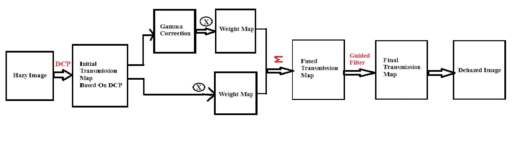
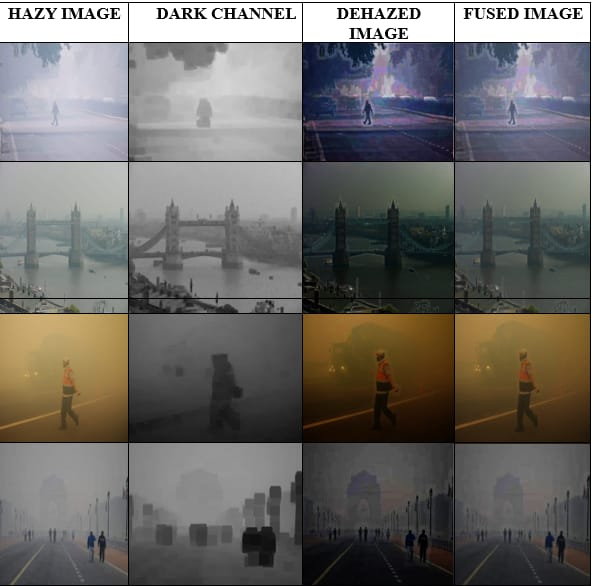

# 🌫️ Image Dehazing and Fusion with Python

Image dehazing is a critical image processing task that aims to enhance the visibility of images that have been degraded by atmospheric haze, fog, or smog.

Haze in images is caused by scattering of light, which reduces contrast, sharpness, and overall image quality. Dehazing techniques are used to remove this unwanted haze and restore the original appearance of the image.

---

## 🔍 Key Techniques Used

- **Dark Channel Prior**: Helps estimate atmospheric light and transmission map; identifies darkest regions in an image.
- **Transmission Map Estimation**: Represents the proportion of light scattered by haze.
- **Gamma Correction**: Enhances visibility and visual quality of the dehazed image.
- **Image Fusion**: Combines the original transmission map with the gamma corrected map to preserve image details.
- **Image Restoration**: Final step that produces the haze-free output image.

---

## 🎯 Project Objective

The goal of this project is to enhance image visibility and quality by developing and implementing effective fusion and dehazing techniques.

Various algorithms like Dark Channel Prior, Transmission Map Estimation, and Image Fusion are used to restore and enhance hazy images.

This project contributes to the fields of computer vision, photography, and image processing by offering effective dehazing methods.

---

## 📸 Screenshots

### 📌 Project Workflow Overview

### ✅ Output Images After Dehazing

---